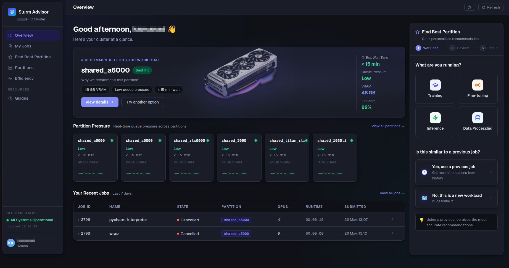
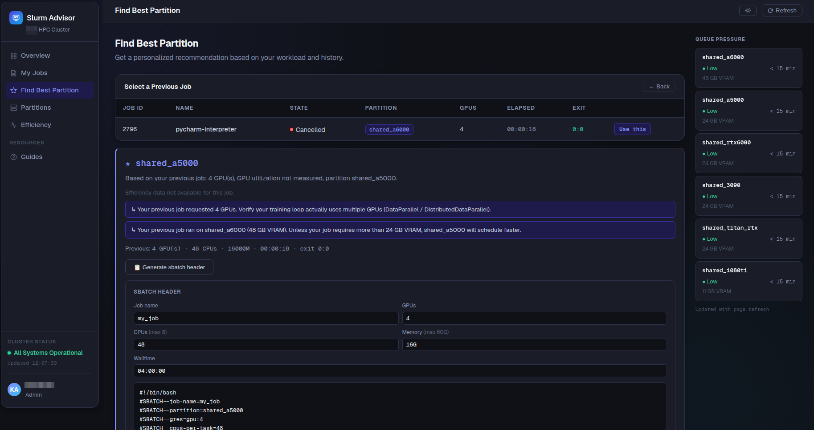
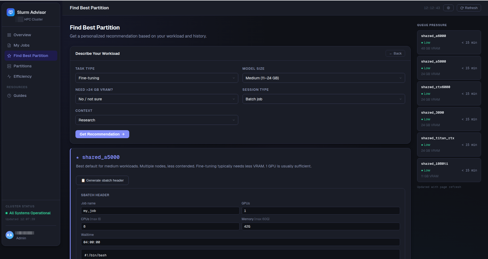
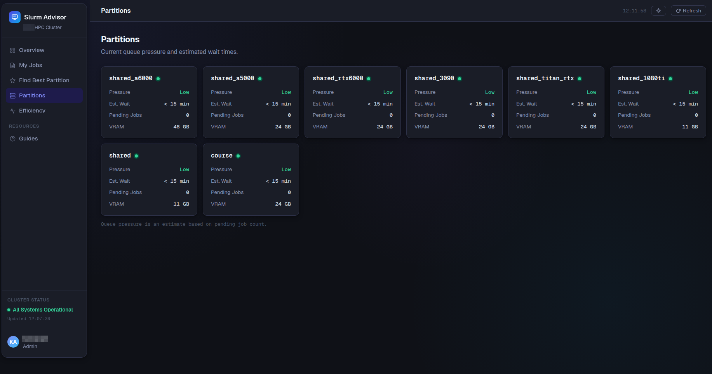
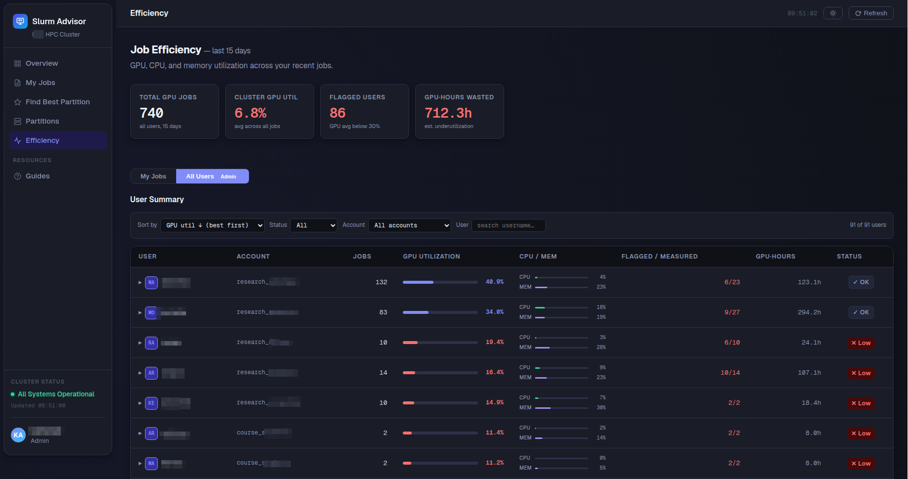
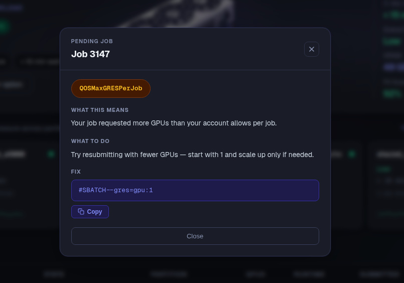

# Slurm Advisor

A web-based job advisor for HPC clusters running Slurm and Open OnDemand. Helps researchers pick the right partition, understand why their jobs are pending, and improve GPU/CPU/memory efficiency — all in plain language.

## Features

**Find Best Partition** — Guided wizard or job-history-based recommendations. Describes your workload, picks the best partition, and generates a ready-to-use `#SBATCH` header.

**Partition Pressure** — Real-time queue pressure and estimated wait times across all partitions. Cached to avoid hammering `squeue`.

**Efficiency** — Per-user GPU, CPU, and memory utilization for completed jobs. Flags underutilizing users and gives actionable recommendations. Admin view shows cluster-wide stats across all users. Powered by [g-seff](https://github.com/Nadavka-cmd/g-seff) — degrades gracefully if unavailable.

**Pending Job Explainer** — Click any pending job to get a plain-English explanation of why it's waiting and exactly what to do about it.

## Stack

- **Backend**: FastAPI + uvicorn
- **Frontend**: Single-page Jinja2 template, no framework
- **Data**: Slurm CLI (`squeue`, `sinfo`, `scontrol`, `sacct`) + [g-seff](https://github.com/Nadavka-cmd/g-seff) for GPU metrics
- **Auth**: Open OnDemand reverse proxy (`X-Remote-User` header)

## Setup

See [docs/setup.md](docs/setup.md) for full installation instructions.

## Related Tools

- [hpc-admin-portal](https://github.com/Nadavka-cmd/hpc-admin-portal-demo) — Web-based Slurm admin portal (QoS, accounts, config sync, AD management)
- [hpc-admin-tui](https://github.com/Nadavka-cmd/hpc-admin-tui) — Terminal UI for cluster administration
- [g-seff](https://github.com/Nadavka-cmd/g-seff) — GPU job efficiency reporter (used as backend by this tool)
